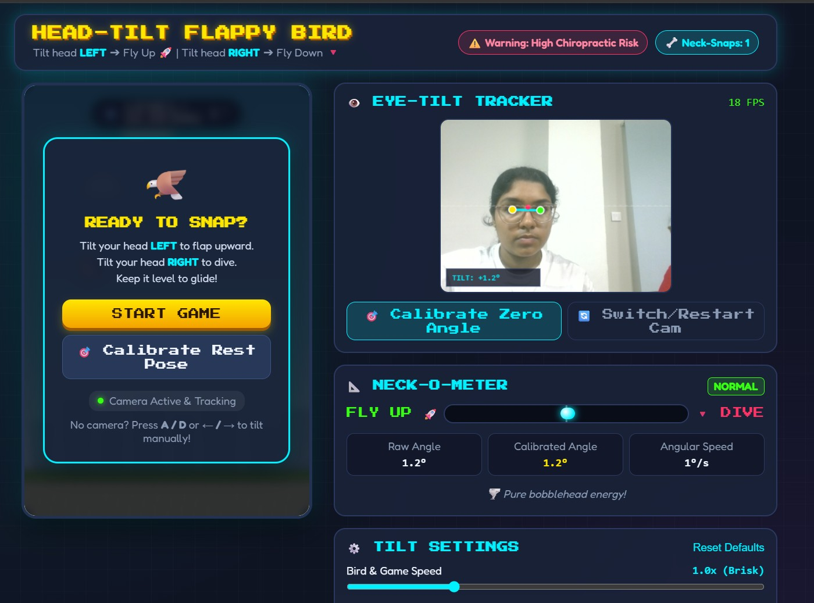
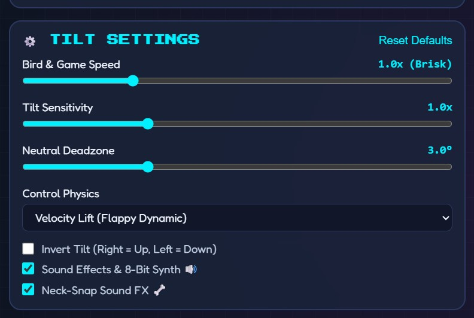
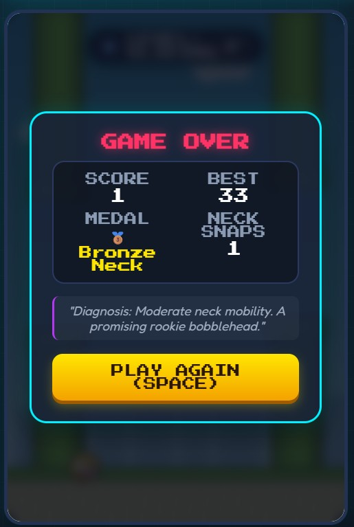
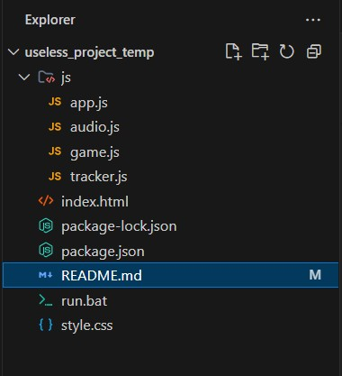

# Head-Tilt Flappy Bird 🦅📐

## Basic Details
<<<<<<< HEAD

### Team Name: NEBULA

### Team Members

* Member 1: Archa Rajeev Nair - MITS
* Member 2: Vrinda Lakshmi - MITS
=======
### Team Name: NEBULA

### Team Members
- Member 1: ARCHA R NAIR
- Member 2: VRINDA LAKSHMI 
>>>>>>> b2a3aadb9e8d0caeb3f5ad8130c15efb42e14522

### Project Description

**Head-Tilt Flappy Bird** is a hilarious, ergonomic-defying interactive webcam game where your bird's altitude is controlled strictly by how far you tilt your head left or right.

By tracking real-time facial landmarks, dodging retro pipes requires players to aggressively snap and tilt their neck back and forth in front of the camera, all while an integrated "Neck-O-Meter" diagnoses their inevitable chiropractic breakdown.

### The Problem (that doesn't exist)

Tapping a screen or pressing a spacebar to play Flappy Bird is far too convenient, comfortable, and risk-free. Modern humans have far too little strain on their cervical vertebrae and look far too dignified sitting at their desks.

This tragic shortage of neck exercise and public embarrassment in casual gaming has gone unaddressed for far too long.

### The Solution (that nobody asked for)

We eliminated all keyboard and touch controls and replaced them with high-frequency head-tilting. Tilting left generates aerodynamic lift, tilting right plunges into a dive, and sudden neck flicks trigger comedic chiropractic warnings, synthesized cartoon pop sounds, and whiplash counters.

*Absolutely no chiropractors or orthopedic surgeons were consulted during development.

## Technical Details

### Technologies/Components Used

For Software:

* **Languages used:** HTML5, CSS3, JavaScript (ES6+)
* **Frameworks used:** None (Pure Vanilla Web Engine)
* **Libraries used:** MediaPipe Face Mesh & Camera Utils (via CDN)
* **Tools used:** VS Code, Git, GitHub, HTML5 Canvas 2D API, Web Audio API

1. **Eye Landmark Angle Calculation:**
   Tracks facial landmarks in real time and calculates the angle vector between your eyes:
    θ = atan2(y_right - y_left, x_right - x_left) × 180/π

3. **Flight Controls:**
   - **Tilt Head Left (ear to left shoulder):** Upward lift 🚀 — instant upward impulse, flaps wings, and ascends.
   - **Tilt Head Right (ear to right shoulder):** Dive 🔻 — tucks wings and plunges downward.
   - **Level Pose:** Glide ⏸️ — gentle neutral sink.

4. **Neck-O-Meter & Neck Snap Counter:**
   - Live spirit-level bubble gauge showing calibrated degrees of tilt.
   - Angular velocity detection triggers cartoon pops and bonus "Neck Snaps" when violently flicking your head.
   - Post-game comedic chiropractic diagnosis.

5. **Keyboard Fallback (for testing without camera):**
   - Press **A** / **←** to tilt Left.
   - Press **D** / **→** to tilt Right.
   - Press **Spacebar** to Start / Restart.

---

## 🚀 How to Run

Because the webcam uses modern browser security (`getUserMedia`), run it over `http://localhost` or `https://archarnair.github.io/useless_project_temp/`:

### Option 1: Double-Click
Double-click `run.bat` to launch the local server and open your browser automatically.

### Option 2: Command Line
```powershell
# From the project folder:
python -m http.server 8080
```

# Run

Run with a local server (required for browser webcam permissions):

```bash
# Option 1: Double-click run.bat (Windows)

# Option 2: Python local HTTP server
python -m http.server 8080

# Option 3: VS Code Live Server extension
Open index.html with Live Server
```

Then visit `http://localhost:8080` in your browser.

## Project Documentation

### Screenshots (Add at least 3)



*The neon arcade interface featuring live webcam facial tracking, calibration HUD, sensitivity controls, and chiropractic risk warnings.*



*Player frantically tilting their head left and right to navigate through procedurally generated pipes while the live spirit-level Neck-O-Meter calculates tilt angle in real time.*



*The final comedic diagnosis screen revealing player score, best score, total neck snaps, and an absurd orthopedic assessment.*

# Diagrams



*The workflow begins with webcam initialization, tracking facial eye landmarks with MediaPipe Face Mesh, calculating the tilt angle vector, updating the spirit-level Neck-O-Meter, and converting lateral head movement into flight physics and neck-snap diagnostics.*

## Project Workflow

```text
        ┌─────────────────────────┐
        │    Webcam Video Feed    │
        └────────────┬────────────┘
                     │
                     ▼
        ┌─────────────────────────┐
        │  MediaPipe Face Mesh    │
        │  (Track Eye Landmarks)  │
        └────────────┬────────────┘
                     │
                     ▼
        ┌─────────────────────────┐
        │  Calculate Tilt Angle θ │
        │  atan2(Δy, Δx) - Offset │
        └────────────┬────────────┘
                     │
                     ▼
        ┌─────────────────────────┐
        │ Update Spirit Level HUD │
        │     & Neck-O-Meter      │
        └────────────┬────────────┘
                     │
         ┌───────────┴───────────┐
         │                       │
         ▼ (Tilt Left)           ▼ (Tilt Right)
    ┌──────────┐           ┌──────────┐
    │ Flap Up  │           │   Dive   │
    │  Lift 🚀 │           │  Down 🔻 │
    └────┬─────┘           └────┬─────┘
         │                       │
         └───────────┬───────────┘
                     │
                     ▼
        ┌─────────────────────────┐
        │  2D Canvas Physics &    │
        │  Procedural Pipe Engine │
        └────────────┬────────────┘
                     │
            ┌────────┴────────┐
            │ Collision / End │
            └────────┬────────┘
                     │
                     ▼
        ┌─────────────────────────┐
        │  Comedic Chiropractic   │
        │  Diagnosis & Neck Snaps │
        └─────────────────────────┘
```

### Project Demo

# Video

https://drive.google.com/file/d/11dyebl5QJqbwm-1mJBCY8qbaSVtVoYAW/view?usp=sharing

*The demo video showcases the complete user journey—from webcam permission and rest-pose calibration, dodging pipes through frantic neck tilts, to triggering hilarious neck-snap sound effects and receiving a post-game chiropractic diagnosis.*

# Additional Demos

* GitHub Repository: https://github.com/archarnair/useless_project_temp
* Live Website: https://archarnair.github.io/useless_project_temp/

## Team Contributions

* **Archa Rajeev Nair:** Game Design and Development: Implemented the core game loop, physics engine, procedural pipe generation, scoring system, and game state management.
* **Vrinda Lakshmi:** UI/UX design, retro neon styling & spirit-level HUD, Web Audio API sound synthesis, chiropractic scoring & neck-snap mechanics.

---

## 🦴 Comedic Chiropractic Diagnoses

Depending on how chaotic your neck-snapping technique is, our state-of-the-art non-certified medical engine will diagnose you with:

* 🩺 **Stiff Cervical Posture:** Tilt your head further to gain altitude!
* 🦆 **Rookie Bobblehead:** Moderate neck mobility with untapped potential.
* ⚡ **Agile Vertebrae:** Pipes tremble in fear of your lateral neck snaps.
* 🌪️ **Flappy Nirvana:** Supersonic neck velocity achieved.
* 💥 **Whiplash Warning:** Extreme 2.5G lateral neck flick detected.
* 🛋️ **Ergonomist's Nightmare:** Spine curvature completely uncalibrated.

---

> **Disclaimer:** This project does not provide actual medical, orthopedic, or chiropractic advice. Any resemblance between your sore neck and our game mechanics is 100% your own fault.

---
Made with ❤️ at TinkerHub Useless Projects 


